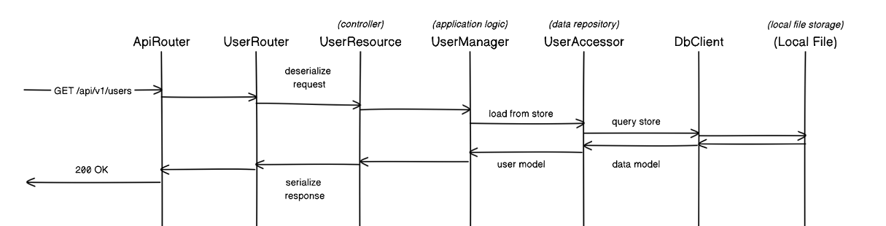

# MyAxumServ

This is a demonstration of a simple CRUD web service for Rust, using `axum` as its web framework.

## Why Axum?

According to [crates.io, when we search for HTTP Server packages and sort by recent downloads](https://crates.io/categories/web-programming::http-server), `axum` is, by a large margin, currently the web framework with the most community support and activity.

## Design

Concerns are separated in this way, using the "List Users" (`GET /api/v1/users`) operation as an example:



(For simplicity, I've implemented a simple file data store, to serve as a plain, local DB client)

## Operations

### GET:list_users

```shell
curl localhost:3000/api/v1/users
```

### POST:create_user

```shell
curl localhost:3000/api/v1/users -H "Content-Type: application/json" --data "{\"username\":\"myUsername\"}"
```

## Dependencies

### Web framework
- **axum**: The star of the show! This web service is built using this framework.
- **tokio**: Transitive dependency of axum. It's only main use here is the annotation on the main() method.
- **tower-service**: Axum uses their `Service` concept as a more complete way to separate routers from handlers  
- **tower-layer**:  Axum uses its `Layer` concept to separate the router from the middleware. Also depends on `Service`.

### ORM
- **serde**: Axum uses this to serialize and deserialize structs. In this application, it's mostly used to label things.
- **serde_json**: Only used for reading and writing from the `resources/local_db.json` file, for DB storage.
  
## Utility
- **uuid**: To set user ID fields as UUIDv4 strings. 